# Jenkins

## 安装

**版本**

最新版需要JDK11、17的支持
我不想再装JDK所以使用的是历史版本 - [2.346.1 下载链接](https://get.jenkins.io/war-stable/2.346.1/)    [历史版本 列表](https://get.jenkins.io/war-stable/)

启动命令

~~~bash
java -jar jenkins.war
~~~

默认密码 C:\Users\sun\.jenkins\secrets\initialAdminPassword

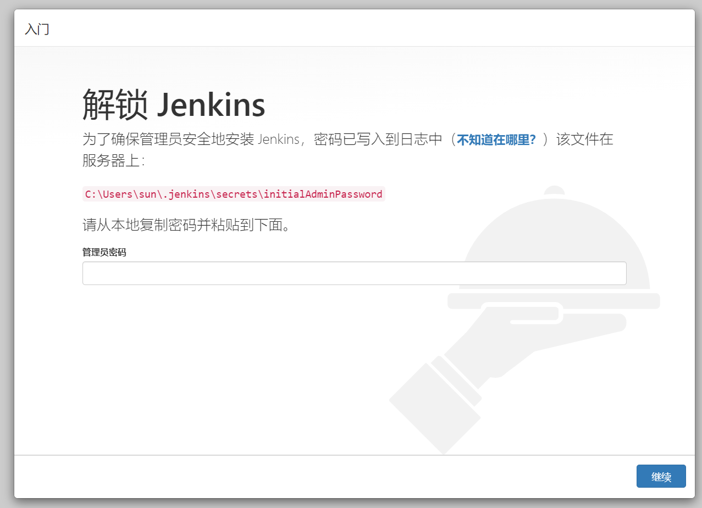

**提示**

Jenkins安装成功后 会让你选择安装插件
两个选项 一个是自定义安装 一个是推荐安装 
可以先不安装 这个插件进去了也是可以装的

#### 安装插件

1. 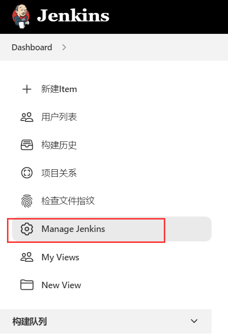
2. 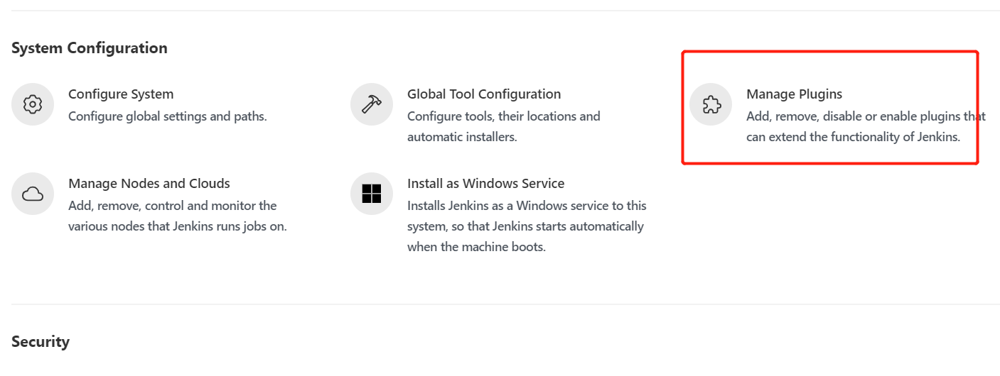
3. 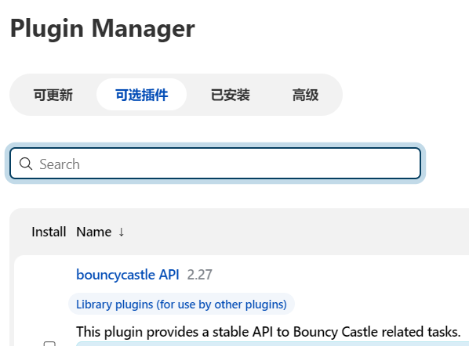
4. 最少需要安装
   中文插件、Git、Maven.. 具体看项目要求
   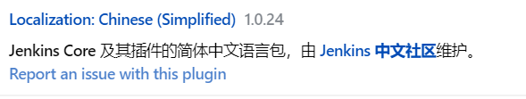
   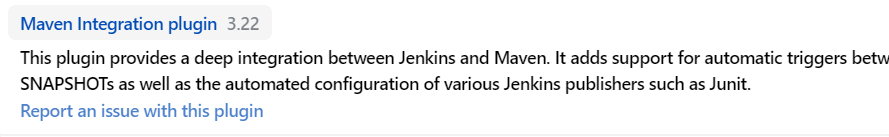
   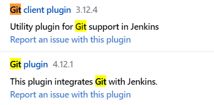

#### 全局配置

1. 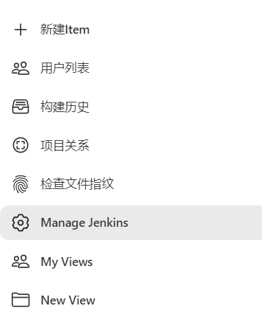
2. 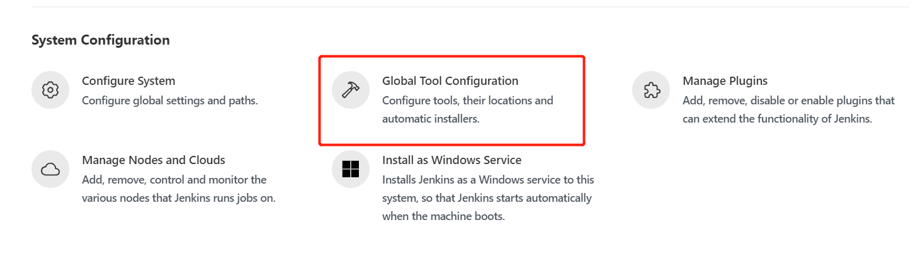
3. Maven配置
   
   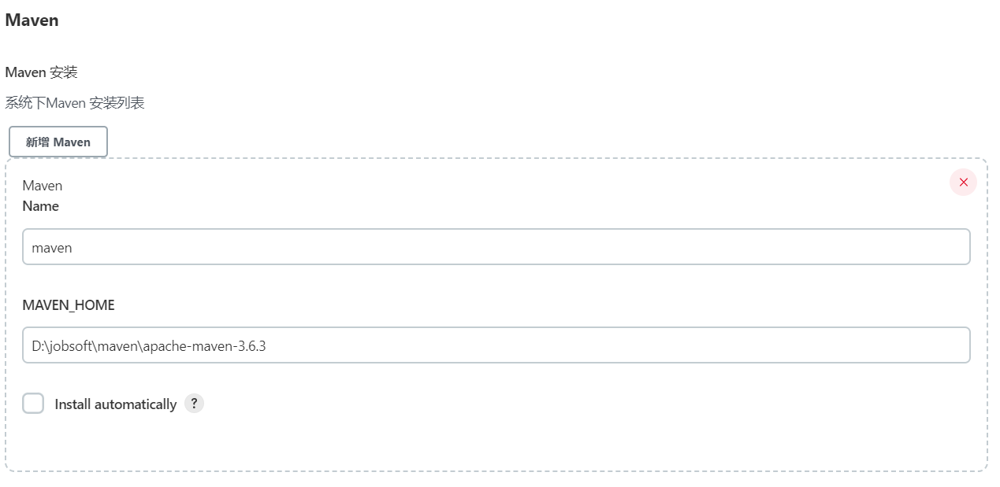
4. JDK配置
   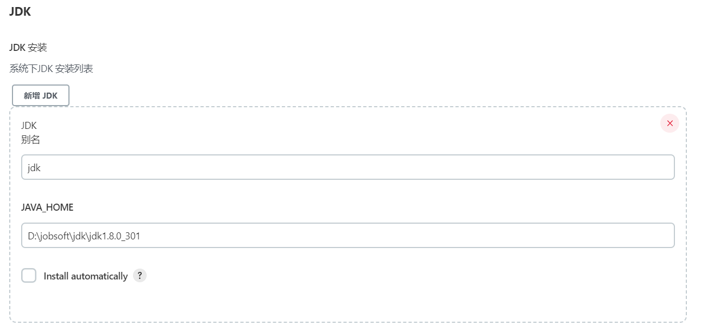
5. Git配置
   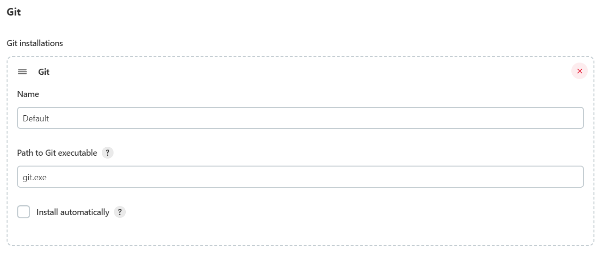

#### Git凭据

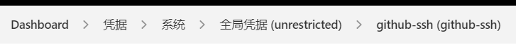

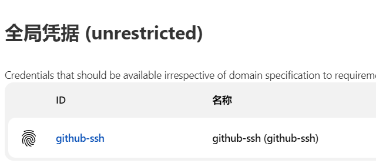

#### 添加任务

1. 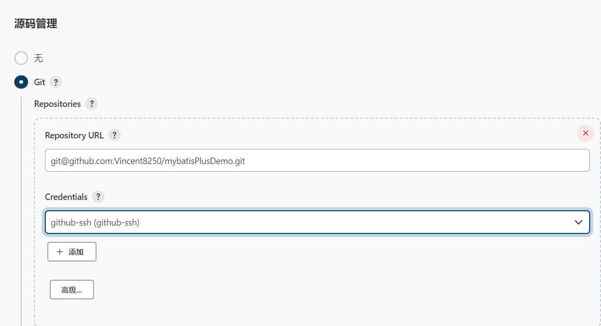
2. 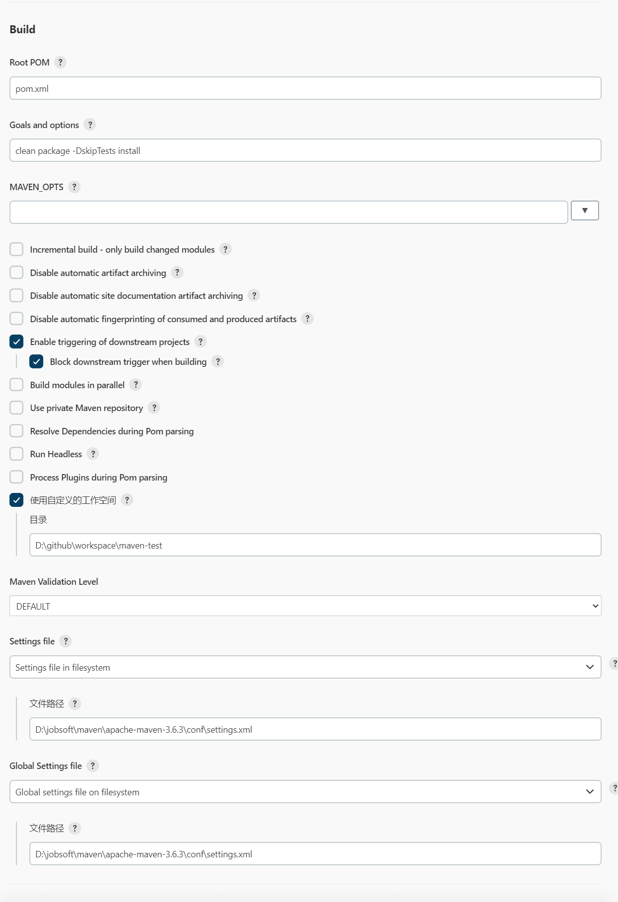
3. 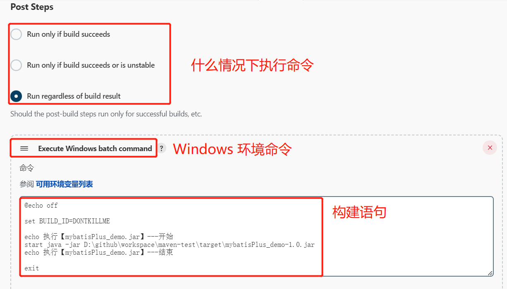

